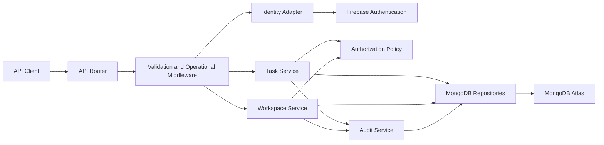

# Component Dependencies

## Dependency Matrix

| Consumer | Dependency | Communication |
|---|---|---|
| API Router | Validation and Operational Middleware | In-process Express middleware |
| API Router | Identity Adapter | In-process token verification |
| API Router | Workspace Service, Task Service | In-process service calls |
| Workspace Service | Authorization Policy, MongoDB Repositories, Audit Service | In-process calls |
| Task Service | Authorization Policy, MongoDB Repositories, Audit Service | In-process calls |
| Identity Adapter | Firebase Authentication | HTTPS SDK/API call |
| MongoDB Repositories | MongoDB Atlas | TLS MongoDB driver connection |
| Audit Service | MongoDB Repositories, structured logger | In-process persistence and logging |

## Data Flow

Mermaid syntax has been validated: IDs contain only letters, labels are quoted, and each connection is valid.

### Text Alternative

An API client calls the API Router. Middleware validates the request and establishes operational context. The Identity Adapter verifies tokens with Firebase. The Task Service or Workspace Service invokes Authorization Policy, accesses MongoDB through repositories, and records mutations through Audit Service. Repositories communicate with MongoDB Atlas over TLS.

## Extension Compliance Summary

| Extension / Rule Group | Status | Rationale |
|---|---|---|
| Security Baseline | Compliant | Dependency boundaries show server-side token verification, authorization before data access, TLS persistence, and separate audit flow. |
| Resiliency Baseline | N/A | Disabled in state tracking. |
| Partial Property-Based Testing | N/A | No property-based test design applies to this relationship map. |
