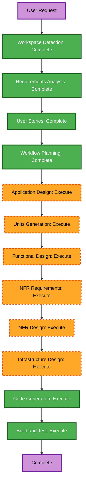

# Execution Plan

## Detailed Analysis Summary

### Change Impact Assessment

- **User-facing changes**: Yes. The API supports workspace owners, members, and client applications.
- **Structural changes**: Yes. A new serverless API, identity adapter, authorization layer, persistence layer, and observability configuration are needed.
- **Data model changes**: Yes. Workspace, membership, task, and audit-event collections are required.
- **API changes**: Yes. New authenticated REST endpoints and contracts are required.
- **NFR impact**: Yes. Security Baseline enforcement requires validation, access controls, structured logging, monitoring, MFA support, and supply-chain safeguards.

### Risk Assessment

- **Risk level**: Medium.
- **Rollback complexity**: Low for direct Vercel deployments, but no formal rollback is in scope because resiliency rules are disabled.
- **Testing complexity**: Moderate due to Firebase token verification, multi-tenant authorization, MongoDB behavior, and property-based testing.

## Workflow Visualization

Mermaid syntax has been validated: node IDs use only letters and underscores, labels are quoted, and all connections are valid.

### Text Alternative

Workspace Detection, Requirements Analysis, User Stories, and Workflow Planning are complete. Application Design and Units Generation will define the system and its work units. Each unit then receives Functional Design, NFR Requirements, NFR Design, Infrastructure Design, Code Generation, and Build and Test.

## Phases to Execute

### INCEPTION

- [x] Workspace Detection: Complete. Greenfield workspace.
- [x] Reverse Engineering: Skipped. No existing codebase.
- [x] Requirements Analysis: Complete.
- [x] User Stories: Complete.
- [x] Workflow Planning: Complete.
- [ ] Application Design: Execute. New components, component responsibilities, and service dependencies need definition.
- [ ] Units Generation: Execute. New schemas, REST contracts, security-sensitive modules, and infrastructure configuration need coordinated units of work.

### CONSTRUCTION

- [ ] Functional Design: Execute per unit. Task lifecycle, membership rules, and audit behavior require explicit business rules.
- [ ] NFR Requirements: Execute per unit. Security, testing, performance, logging, and Firebase/MongoDB integration requirements apply.
- [ ] NFR Design: Execute per unit. Security mechanisms and partial PBT patterns must be incorporated.
- [ ] Infrastructure Design: Execute per unit. Vercel, MongoDB Atlas, Firebase, secrets, logging, and alerting need concrete mapping.
- [ ] Code Generation: Execute per unit. Required for implementation and tests.
- [ ] Build and Test: Execute. Required for build, unit, integration, security, and property-based test instructions.

### OPERATIONS

- [ ] Operations: Placeholder. No current execution steps.

## Proposed Units of Work

1. **Foundation and Identity**: TypeScript/Express serverless entrypoint, configuration, Firebase verification, health checks, validation, error handling, and observability foundations.
2. **Workspace and Task Domain**: MongoDB models, membership authorization, task CRUD, filters, due-date behavior, audit events, and API routes.
3. **Quality and Delivery**: Jest/fast-check tests, Vercel configuration, security headers/rate limiting, dependency scanning, SBOM generation, and deployment documentation.

## Success Criteria

- A Vercel-deployable REST API securely verifies Firebase tokens and isolates data by workspace.
- Workspace members can manage tasks with status, priority, due-date, pagination, and filters.
- The implementation meets applicable Security Baseline constraints.
- Example-based and partial property-based tests validate domain behavior.

## Extension Compliance Summary

| Extension / Rule Group | Status | Rationale |
|---|---|---|
| Security Baseline | Compliant | All applicable security design, implementation, and verification stages are included. |
| Resiliency Baseline | N/A | Disabled in state tracking. |
| Partial Property-Based Testing | Compliant | Functional/NFR design and code/test stages will address the enforced PBT rules. |
